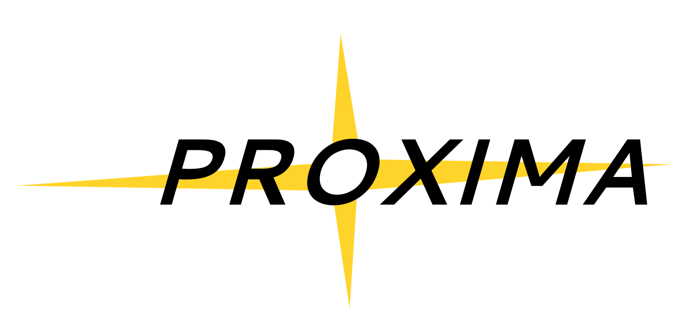

# Proxima
Repo for the open source Proxima AstroCamera family

## About
The Proxima AstroCamera is a general purpose CCD/CMOS imager intended for use for amateur astrophotography and citizen science/outreach.  The project aligns closely with [The Flame Trench](http://theflametrench.com)'s [Gaze](http://theflametrench.com/flagship#/gaze) robotic observatory project.  The intent is to develop configurable CCD/CMOS front-end variants and an ASCOM compatible, FPGA-based back-end compute module.  This will come in ethernet based Alpaca and USB-3 based ASCOM/native variants.

## Specifications
The following are provisional design goals of the Proxima project:
* DSLR CCD/CMOS
   * mono/bayered
   * interline/full frame
* Programmable bias voltages, to allow for the front-end to be CCD agnostic
* Tuned clocking drivers for the same reason
* Separate CMOS driver front-end variant
* Full ASCOM compliancy, for compatibility with current astrophotography/astronomy session management and capture software suites
* Active cooling, to reduce dark current noise to the minimum feasible
* USB 3 support, to prevent data downlinking causing a bottleneck within the system, and allowing for fast image frequencies
* Ethernet support in a Linux SoC/Alpaca back-end variant
* Memory buffers for fast framerate CMOS readout
* Sealed/purged cold room
   * Provisional goal which would allow for much colder CCD temperatures by absorbing or purging moisture from the enclosure
* 12-19V DC supply, to allow for AC mains + power supply or power direct from battery
